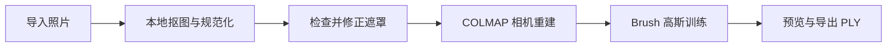

<div align="center">
  
  <h1>IA'GS</h1>
  <p><strong>把一组照片，变成可以自由观看的 3D 高斯模型。</strong></p>
  <p>为 Apple Silicon Mac 设计 · 本地抠图与重建 · 无需云端 GPU</p>
  <p>
    <a href="https://github.com/by-lastime/IA-GS/releases/tag/v0.1.0">下载 macOS 测试版</a> ·
    <a href="#从源码运行">从源码运行</a> ·
    <a href="https://github.com/by-lastime/IA-GS/issues">反馈问题</a> ·
    <a href="README_EN.md">English</a>
  </p>
  <p>
    
    
    <a href="LICENSE"></a>
    <a href="https://github.com/by-lastime/IA-GS/actions/workflows/macos.yml"></a>
  </p>
</div>


IA'GS 将照片整理、前景分割、相机重建和高斯训练放进同一个桌面工作流。给任务起一个名字，导入同一物体的照片，检查抠图结果，再选择 **Plus** 或 **Pro**，即可开始生成。完成后可以在应用中旋转、缩放、裁切和导出模型。

这是基于 [OOOSplat 0.4.1](https://github.com/ooolabdev/ooosplat) 的独立开源衍生项目。IA'GS 增加了 macOS 原生照片处理、遮罩检查、相机分组和任务界面；底层重建与训练分别由 [COLMAP](https://github.com/colmap/colmap) 和 [Brush](https://github.com/ArthurBrussee/brush) 提供。

## 能做什么

- **导入后自动处理照片。** Apple Vision 在本机分割前景，同时规范 EXIF 方向、色彩和尺寸；保留原始照片副本。
- **抠图结果可检查、可修正。** 点击重选前景，用笔刷补回或擦除遮罩，排除不合适的照片，再确认进入重建。
- **按拍摄信息处理相机。** 参考镜头、EXIF 焦距、数字变焦和图像尺寸分组，避免将所有照片强制视为同一台相机。不会把照片里的物体逐张拉伸到相同大小。
- **两种模式，真实进度。** Plus 用于更快预览，Pro 用于更充分训练；Splat 百分比读取 Brush 的实际迭代计数。
- **生成后直接查看。** 支持高斯 PLY 预览、方向和缩放调整、裁切、编辑与导出，可接入支持高斯模型的网页查看器。
- **任务集中管理。** 命名、搜索、最近五条与折叠历史、一键在访达中打开；中英文、四种配色、自定义背景。
- **数据留在本机。** 无需账号或 API Key；应用不上传照片、不调用云端大模型，已移除遥测网络客户端。

## 安装

**系统要求：Apple Silicon（M 系列芯片），macOS 15 或更新版本。** 暂不支持 Intel Mac、Windows 和 Linux。

1. 在 [Releases](https://github.com/by-lastime/IA-GS/releases/tag/v0.1.0) 下载 `IA-GS-0.1.0-macOS-AppleSilicon.dmg`。
2. 打开 DMG，将 **IA'GS** 拖到 **Applications / 应用程序**。
3. 启动应用，新建任务并填写名称。

安装包内含照片处理组件、COLMAP、Brush 及所需动态库；使用安装版不需要配置 Python、Node.js、Rust 或 Homebrew。首次下载需要联网，照片处理和训练在本地完成。

> **v0.1.0 为早期测试版。** 当前安装包采用 ad-hoc 签名，尚未获得 Apple Developer ID 签名或 Apple 公证；从互联网下载后，macOS 可能拦截首次启动。请参照 [Apple 的打开应用说明](https://support.apple.com/zh-cn/102445)，不要全局关闭系统安全保护。下载页附 SHA-256 校验文件。

## 从照片到模型



**准备照片 → 命名任务 → 导入并检查 → 选择模式 → 开始生成。**

| 模式 | 适合的使用方式 |
| --- | --- |
| **Plus** | 先观察照片能否重建，快速检查构图与视角覆盖 |
| **Pro** | 对合适的素材进行更充分的训练；耗时通常更长 |

两种模式使用同样的抠图质量和全部已确认照片。照片、遮罩及相机信息不变时，切换模式可以复用已完成的相机重建；新训练结果存入独立项目。

初始模型保存在 `results/final.ply`，项目根目录另保留一份 `final.ply` 供内置查看器使用。编辑后请通过导出功能保存修改版本。它是 **Gaussian Splat PLY**，不是带面片的传统网格；网页展示需要兼容的高斯渲染器。

## 拍摄建议与边界

建议围绕静止物体拍摄约 30–100 张清晰、连续重叠的照片，尽量固定镜头和变焦，补齐不同高度的视角。实际效果取决于素材，而不只取决于训练模式。

- 支持 **JPG / JPEG / PNG 文件夹**；暂不支持视频、HEIC 和 RAW。
- 玻璃反射、高反光金属、透明物体、模糊照片和缺失视角仍可能导致重建失败或残缺。抠图不能解决这些拍摄问题。
- 不生成缺失纹理、不重绘物体、不自动消除高光。相机分组也不能把失焦照片变清晰。
- 自动遮罩需要人工复核。训练完成不等于获得完整、准确或适合测量的三维记录。
- 大量或高分辨率照片需要更多内存和时间。当前没有宣称统一的最低内存门槛；现有本地验证使用 M4、24 GB Mac。

## 从源码运行

需要 Apple Silicon Mac、macOS 15+、Node.js 24、Rust stable，以及 Xcode Command Line Tools。

```sh
xcode-select --install  # 尚未安装时执行

git clone https://github.com/by-lastime/IA-GS.git
cd IA-GS
npm ci
npm run setup:engines:macos
npm run start:app
```

首次设置会下载清单中指定的上游引擎并校验完整性。`start:app` 构建原生照片助手并启动 Tauri 开发窗口。`npm run dev` 只启动网页开发服务，不能独立运行本地文件处理和重建。

```sh
# 生成 .app 与 .dmg
npm run package:macos

# 源码检查
npm test
npm run build
npm run verify:licenses
cargo test --manifest-path src-tauri/Cargo.toml --locked
cargo clippy --manifest-path src-tauri/Cargo.toml --all-targets -- -D warnings
```

安装包输出到 `src-tauri/target/release/bundle/`。默认使用 ad-hoc 签名；正式签名与公证需配置维护者自己的 Apple 凭据。

## 文档与验证

| 文档 | 内容 |
| --- | --- |
| [使用与 CLI](docs/USAGE.md) | 命令行、项目目录、照片与模型的保存方式 |
| [技术说明](docs/ARCHITECTURE.md) | 分割、相机分组、缓存和真实训练进度 |
| [测试记录](docs/VALIDATION.md) | 已完成的检查、实际样本和未验证范围 |
| [上游修改说明](docs/CHANGES_FROM_UPSTREAM.md) | IA'GS 相对于 OOOSplat 的变更 |
| [贡献指南](CONTRIBUTING.md) | 开发约定、测试和问题反馈 |
| [后续计划](ROADMAP.md) | 计划与当前范围 |

发布前本地验证：**104 项前端测试、124 项 Rust 单元测试通过**，并完成真实 Plus 重建、短时 Metal 进度测试和安装包启动检查。完整 Pro 训练及更多设备、素材仍需持续验证；详细条件见测试记录。

## 许可证与致谢

IA'GS 采用 [Apache License 2.0](LICENSE)，保留 [NOTICE](NOTICE) 和 [第三方声明](licenses/THIRD_PARTY_NOTICES.txt)。它不是 OOOSplat 官方版本，也不代表上游认可或背书；原项目商标政策保留在 [TRADEMARK_POLICY.md](TRADEMARK_POLICY.md)。

感谢 **OOOSplat、COLMAP、Brush、PlayCanvas、Tauri** 及其他依赖项目。Apple Vision 由 macOS 提供，其系统模型并非本仓库发布的开源模型。输入照片和生成影像的权利不因软件许可证而改变。
