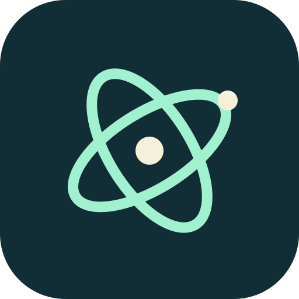
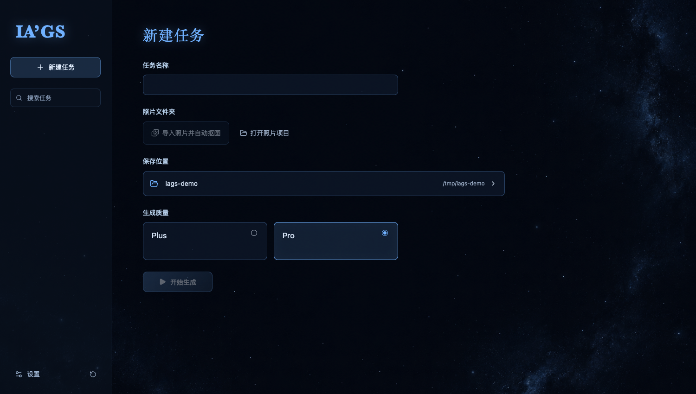

<div align="center">
  
  <h1>IA'GS</h1>
  <p><strong>Turn a set of photos into an explorable 3D Gaussian model.</strong></p>
  <p>Built for Apple Silicon · Local photo preparation and reconstruction · No cloud GPU required</p>
  <p>
    <a href="https://github.com/by-lastime/IA-GS/releases/tag/v0.1.0">Download for macOS</a> ·
    <a href="#build-from-source">Build from source</a> ·
    <a href="https://github.com/by-lastime/IA-GS/issues">Report an issue</a> ·
    <a href="README.md">简体中文</a>
  </p>
</div>



IA'GS brings photo preparation, foreground segmentation, camera reconstruction and Gaussian training into one desktop workflow. Name a task, import photos of an object, review the masks and choose **Plus** or **Pro**. Inspect, rotate, scale, crop and export the resulting model in the app.

An independent, open-source derivative of [OOOSplat 0.4.1](https://github.com/ooolabdev/ooosplat), IA'GS adds native macOS photo preparation, editable masks, camera grouping and a task-oriented interface. Reconstruction and training are powered by [COLMAP](https://github.com/colmap/colmap) and [Brush](https://github.com/ArthurBrussee/brush).

## Features

- **Local photo preparation.** Apple Vision foreground segmentation, EXIF orientation, sRGB conversion and proportional resizing. Original copies are retained.
- **Review before reconstruction.** Select foreground instances, restore or erase mask areas with a brush, and exclude unsuitable images.
- **Camera-aware inputs.** Group images using lens, focal-length, digital-zoom and image-size metadata instead of forcing every image to share one camera. Objects are not individually stretched or centered.
- **Two training modes.** Plus for faster previews; Pro for longer training. Training percentages come from actual Brush iteration counters.
- **Built-in Gaussian viewer.** Inspect, transform, crop, edit and export Gaussian PLY models for compatible viewers and web exhibits.
- **Task management and appearance.** Named tasks, search, five recent tasks with expandable history, Finder access, Chinese/English, four accent colors and custom local backgrounds.
- **Local processing.** No account or API key required. Photos are not uploaded; the app does not call cloud image-generation services, and its telemetry network client has been removed.

## Install

**Apple Silicon Mac, macOS 15 or later.** Intel Macs, Windows and Linux are currently unsupported.

1. Download `IA-GS-0.1.0-macOS-AppleSilicon.dmg` from [Releases](https://github.com/by-lastime/IA-GS/releases/tag/v0.1.0).
2. Open the DMG and drag **IA'GS** into **Applications**.
3. Launch the app and create a named task.

The installer includes the photo helper, COLMAP, Brush and their required libraries. End users do not need Python, Node.js, Rust or Homebrew. Downloading requires internet access; photo processing and training run locally.

> **v0.1.0 is an early test release.** The installer is ad-hoc signed, without an Apple Developer ID signature or Apple notarization. macOS may block its first launch after download. Refer to [Apple's application-opening guidance](https://support.apple.com/en-us/102445); do not disable system security globally. SHA-256 checksums are included with the release.

## Workflow

**Import → prepare → review masks → reconstruct cameras → train → inspect and export.**

| Mode | Intended use |
| --- | --- |
| **Plus** | Quickly check whether a photo set reconstructs and whether its views cover the object |
| **Pro** | Train suitable input more thoroughly, usually at a higher time cost |

Both modes use the same segmentation quality and all approved photos. Unchanged photos, masks and camera information allow camera reconstruction to be reused across modes; each new training result is stored separately.

The initial model is saved to `results/final.ply`, with a matching root-level `final.ply` for the built-in viewer. Export edited results explicitly. This is a **Gaussian Splat PLY**, not a conventional triangle mesh; web display requires a compatible Gaussian renderer.

## Capture and limitations

Start with roughly 30–100 sharp, overlapping views of a stationary object. Keep the lens and zoom consistent, move around the object and capture different heights. This is a starting point, not a guarantee of reconstruction quality.

- Accepts **JPG / JPEG / PNG folders**. Video, HEIC and RAW input are not supported.
- Glass reflections, shiny metal, transparent surfaces, motion blur and missing views remain difficult. Removing backgrounds does not solve those capture problems.
- The app does not invent missing textures, redraw objects or remove real highlights. Camera grouping cannot repair an out-of-focus photo.
- Automatic masks require review. A completed PLY is not a guarantee of completeness or measurement accuracy.
- Larger datasets need more memory and time. Current local validation used an M4 Mac with 24 GB memory; no universal minimum-memory claim has been established.

## Build from source

Requirements: Apple Silicon, macOS 15+, Node.js 24, Rust stable and Xcode Command Line Tools.

```sh
xcode-select --install  # if not already installed

git clone https://github.com/by-lastime/IA-GS.git
cd IA-GS
npm ci
npm run setup:engines:macos
npm run start:app
```

Engine setup downloads the official OOOSplat installer with a pinned SHA-256, mounts it read-only and extracts/verifies its runtime without installing or launching OOOSplat. `start:app` builds the native photo helper and launches Tauri. `npm run dev` alone serves the frontend and cannot perform native file processing or reconstruction.

```sh
# Build .app and .dmg
npm run package:macos

# Validate the source
npm test
npm run build
npm run verify:licenses
cargo test --manifest-path src-tauri/Cargo.toml --locked
cargo clippy --manifest-path src-tauri/Cargo.toml --all-targets -- -D warnings
```

Bundles are written to `src-tauri/target/release/bundle/`. The default signing identity is ad-hoc; Developer ID signing and notarization require the maintainer's own Apple credentials.

## Documentation and validation

- [Usage and CLI](docs/USAGE.md) — commands, project files and mode parameters (Chinese).
- [Architecture](docs/ARCHITECTURE.md) — segmentation, cameras, cache and measured progress.
- [Validation](docs/VALIDATION.md) — tested scenarios and explicit limitations (Chinese).
- [Changes from upstream](docs/CHANGES_FROM_UPSTREAM.md) — the scope of this derivative (Chinese).
- [Contributing](CONTRIBUTING.md) and [roadmap](ROADMAP_EN.md).

Pre-release local validation passed **104 frontend tests and 124 Rust unit tests**, plus a real Plus reconstruction, a short Metal progress test and installer launch checks. A full Pro run and broader device/dataset coverage remain to be validated; see the test record for conditions.

## License and acknowledgments

[Apache License 2.0](LICENSE), with preserved [NOTICE](NOTICE) and [third-party notices](licenses/THIRD_PARTY_NOTICES.txt). IA'GS is not an official OOOSplat release and is not endorsed by its upstream authors. The original [trademark policy](TRADEMARK_POLICY.md) remains available.

Thanks to **OOOSplat, COLMAP, Brush, PlayCanvas, Tauri** and the other dependencies. Apple Vision is provided by macOS; its system models are not open-source assets distributed by this repository. The software license does not change rights to input photos or generated imagery.
